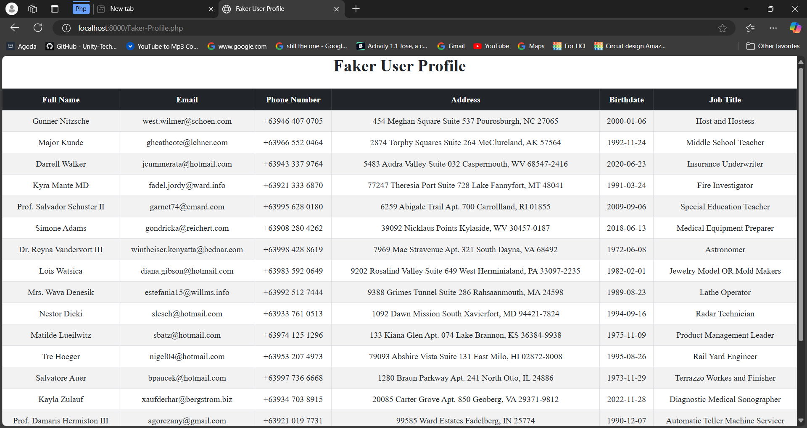
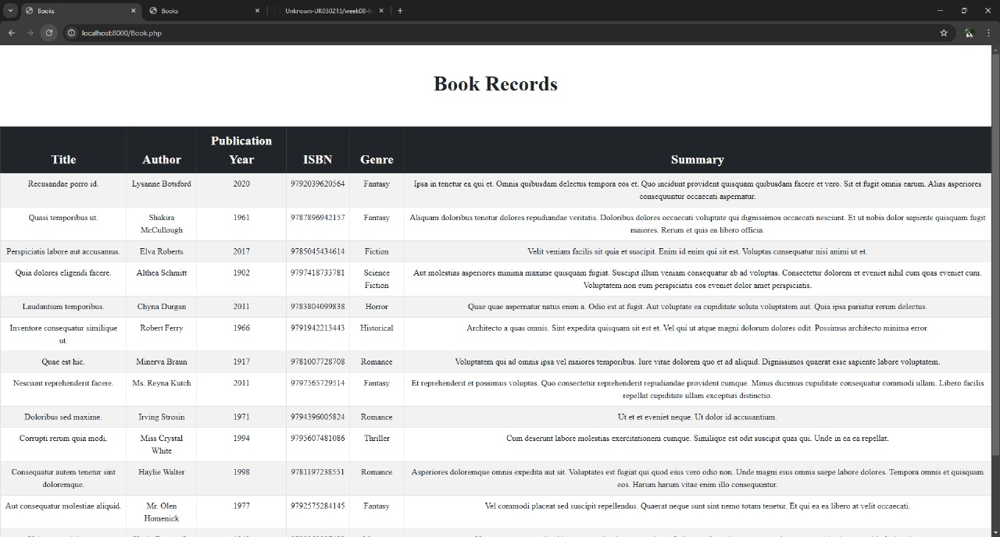
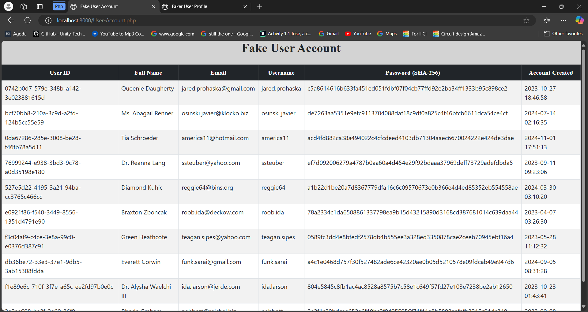

## Faker-Profile.php
    Php Code:
    <?php 
        require 'vendor/autoload.php';

        $faker = Faker\Factory::create('fil_PH');
        

        for ($i = 0; $i < 5; $i++) {
            echo "<tr>";
            echo "<td>" . $faker->name() . "</td>";
            echo "<td>" . $faker->email() . "</td>";
            echo "<td>+63" . $faker->numerify("9## ### ####") . "</td>";
            echo "<td>" . $faker->address() . "</td>";
            echo "<td>" . $faker->date('Y-m-d') . "</td>";
            echo "<td>" . $faker->jobTitle() . "</td>";
            echo "</tr>";
        }
    ?>

Uses the Faker library to generate random Filipino data.

### Output:

## Book.php
    php code:

    
    <?php 
            require 'vendor/autoload.php';
            $faker = Faker\Factory::create('fil_PH');
            $genres = ["Fiction", "Mystery", "Science Fiction", "Fantasy", "Romance", "Thriller", "Historical", "Horror"];

            $books = [];

            for ($i = 1; $i <= 15; $i++) {
                $books[] = [
                    'title' => $faker->sentence(3),
                    'author' => $faker->name,
                    'publication_year' => rand(1900, 2024),
                    'isbn' => $faker->isbn13,
                    'genre' => $genres[array_rand($genres)],
                    'summary' => $faker->paragraph,
                ];
            };

                
        ?>

    <?php foreach ($books as $book): ?>
        <tr>
            <td><?= $book['title'] ?></td>
            <td><?= $book['author'] ?></td>
            <td><?= $book['publication_year'] ?></td>
            <td><?= $book['isbn'] ?></td>
            <td><?= $book['genre'] ?></td>
            <td><?= $book['summary'] ?></td>
        </tr>
    <?php endforeach; ?>

 the Faker library to create an array of 15 randomly generated books, each with a fake title, author, publication year, ISBN, genre (chosen from a predefined list), and summary, which are then displayed as table rows in an HTML format.

### Output:

## User-Account.php
    Php Code:
    <?php
                    require 'vendor/autoload.php';

                    $faker = Faker\Factory::create('en_PH');

                    for ($i = 0; $i < 10; $i++) {
                        $fullName = $faker->name;
                        $email = $faker->email;
                        $username = explode('@', $email)[0];
                        $password = hash('sha256', $faker->password);
                        $uuid = $faker->uuid;
                        $createdAt = $faker->dateTimeBetween('-2 years', 'now')->format('Y-m-d H:i:s');

                        echo "<tr>";
                        echo "<td>$uuid</td>";
                        echo "<td>$fullName</td>";
                        echo "<td>$email</td>";
                        echo "<td>$username</td>";
                        echo "<td class='password-cell'>$password</td>";
                        echo "<td>$createdAt</td>";
                        echo "</tr>";
                    }
                ?>

the Faker library to create 10 random user entries, each containing a UUID, full name, email, derived username, SHA-256 hashed password, and a randomly generated account creation date within the past two years, displaying them in an HTML table.
### Output:
